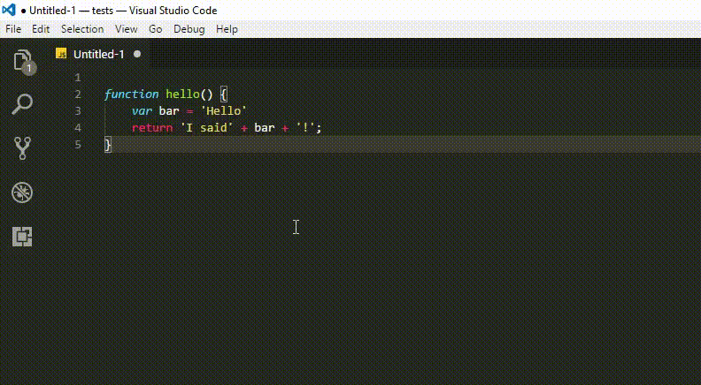

# Log Wrapper for VS Code

Customized log code wrapper for all languages, based on [Console Wrap for Sublime Text](https://github.com/unknownuser88/consolewrap)

## Features

By pressing `ctrl+shift+q` you can print a log message for different languages, formatted, legible, and indented.

> Also, if you want to insert the log before the selection, you can use `ctrl+shift+alt+q`

## Extension Settings

- `debugwrapper.wrappers`: list of wrappers based in the language
    - `$eSEL`: escaped selection
    - `$SEL`: non-escaped selection

Example:

    {
        "javascript": "console.log('$eSEL', $SEL)",
        "typescript": "console.log('$eSEL', $SEL)",
        "default": "print($SEL);"
    }

> Default will be used if it doesn't find the wrapper for the selected language

## Usage
Press `ctrl+shift+q` to insert it after the selection line, or `ctrl+shift+alt+q` to insert it before the selection line.

If you want to customize it, set a keybind to `extension.debugWrapAfter` to insert the wrap after the selection, or `extension.debugWrapBefore` to insert before.

Also, you can use the Menu option, by searching `Debug Code Wrapper` in the command menu.

## LICENSE
See [License](LICENSE) file.